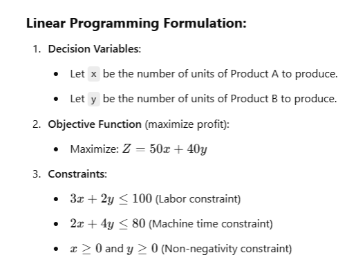

# EXP 5:Prescriptive Analytics
## Aim: 
To solve linear programming (LP) problems, you can use Python's PuLP library, which is a tool for modeling and solving linear programming problems. In this example, we’ll walk through solving a simple linear programming problem using PuLP, interpreting the optimization results, and providing the necessary code.

## Problem Setup:
1. Let’s assume you are a manager at a company that produces two products (Product A and Product B).
2. The company has the following constraints:
3. Each unit of Product A requires 3 hours of labor and 2 hours of machine time.
4. Each unit of Product B requires 2 hours of labor and 4 hours of machine time.
5. The company has a total of 100 hours of labor and 80 hours of machine time available.
6. Product A gives a profit of $50 per unit, and Product B gives a profit of $40 per unit.
7. Your objective is to determine how many units of each product to produce in order to maximize profit, given the available resources.

## PROGRAM: 
```py
# Python Code Using PuLP
# Import PuLP library
from pulp import LpMaximize, LpProblem, LpVariable, lpSum

# Create the linear programming problem (maximize profit)
problem = LpProblem("Maximize_Profit", LpMaximize)

# Decision variables: number of units to produce of Product A and Product B
x = LpVariable("x", lowBound=0, cat='Continuous')  # Product A
y = LpVariable("y", lowBound=0, cat='Continuous')  # Product B

# Objective function: Maximize profit
problem += 50 * x + 40 * y, "Total Profit"

# Constraints: labor and machine time
problem += 3 * x + 2 * y <= 100, "Labor constraint"
problem += 2 * x + 4 * y <= 80, "Machine time constraint"

# Solve the problem
problem.solve()

# Output the results
print(f"Status: {problem.status}, {LpStatus[problem.status]}")
print(f"Units of Product A to produce: {x.varValue}")
print(f"Units of Product B to produce: {y.varValue}")
print(f"Total Profit: ${problem.objective.value()}")
```
## Expected Output:
```
Status: 1, Optimal
Units of Product A to produce: 20.0
Units of Product B to produce: 10.0
Total Profit: $1300.0
```
## Interpretation of Results:
1.Status:

Status: 1, Optimal indicates that the optimization problem has been successfully solved, and an optimal solution has been found.

2.Units to Produce:

The optimal solution suggests that the company should produce 20 units of Product A and 10 units of Product B to maximize profit.

3.Total Profit:

The total profit from producing 20 units of Product A and 10 units of Product B will be $1300.

## Explanation of the Code:

1.Problem Setup:

problem = LpProblem("Maximize_Profit", LpMaximize): This creates a linear programming problem with the objective of maximization (LpMaximize).

2.Decision Variables:

x = LpVariable("x", lowBound=0, cat='Continuous'): Represents the number of units of Product A to produce. It is a continuous variable and must be non-negative (lowBound=0).

y = LpVariable("y", lowBound=0, cat='Continuous'): Represents the number of units of Product B to produce.

3.Objective Function:

The objective function is set as 50 * x + 40 * y, representing the profit for each product. This is added to the problem using problem +=.

4.Constraints:

The labor and machine time constraints are defined: 3 * x + 2 * y <= 100 for labor, and 2 * x + 4 * y <= 80 for machine time.

5.Solving the Problem:

problem.solve() solves the linear programming problem.

6.Output:

After solving the problem, the results (status, values of x and y, and the total profit) are printed.

## Result: 
The optimal solution satisfies all constraints and maximizes the objective function, providing the best possible outcome for the given problem.

